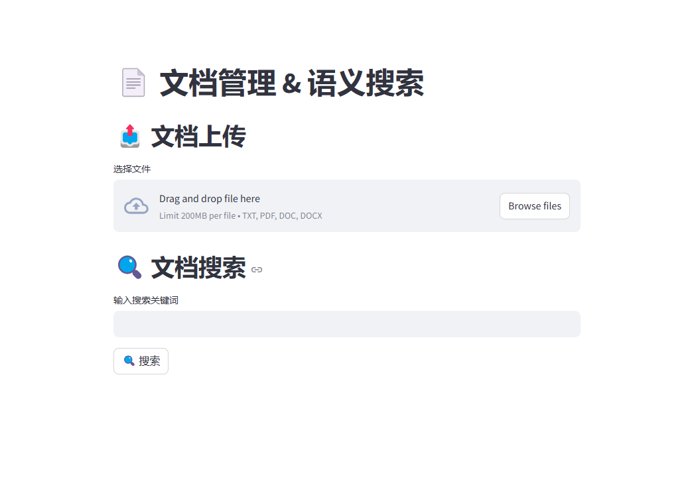
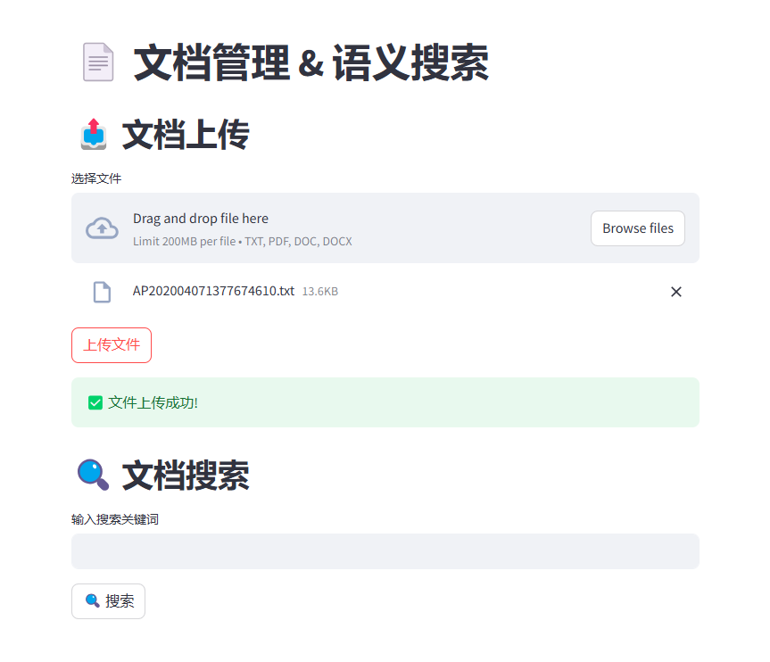
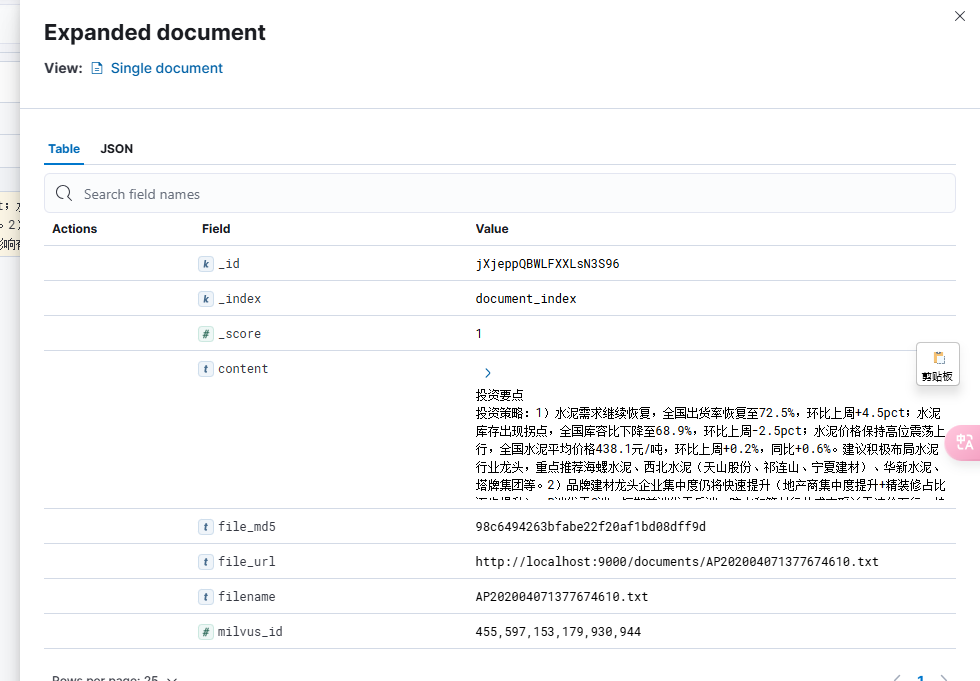
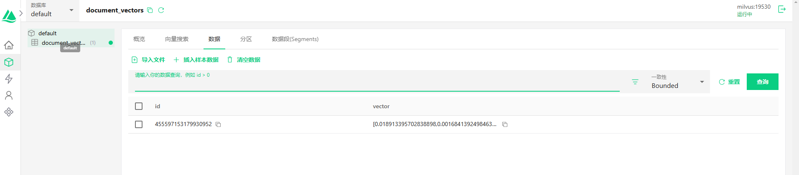
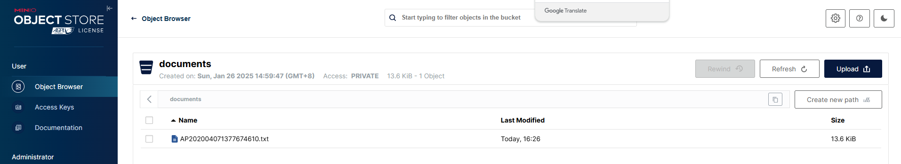
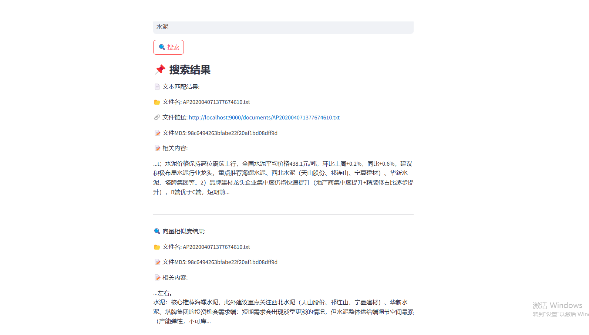

 <h1>📚 Any Library 📚</h1>
  <h2> <a href="README-ZH.md">🇨🇳 中文文档</a></h2>

### Document Upload and Document Search

## 🎯 Overall Concept
Due to the existence of a large number of documents and materials, many scenarios require tracking documents based on specific sentences or images and interpreting their contents. In traditional search operations, combining search engines and vector queries with LLM can achieve many unexpected extended functionalities.

## 🏗️ Overall Architecture
- Elasticsearch stores exact text and provides precise queries
- Apache Tika extracts various text documents
- Milvus stores vector data and provides vector queries
- Minio stores files, provides file upload and download
- Streamlit for frontend display

## 📁 Directory Structure
- /test Test directory
- /upload.py Document upload and semantic search, program entry
- /requirements.txt Dependency definitions
- /docker-compose.yml Docker file to start minio, milvus, elasticsearch, kibana

## ⚙️ Environment Setup
- Start docker-desktop
  - docker-compose down -v [minio, milvus, elasticsearch] Remove containers
  - docker-compose up -d [minio, milvus, elasticsearch] Start containers
- Execute docker-compose.yml to start minio, milvus, elasticsearch
- Run pip install -r requirements.txt to install dependencies
- streamlit run ./upload.py to start the program

## 🎬 Demo Showcase
### 📤 Homepage

### 📤 Document Upload

### 📄 Elasticsearch File Storage

### 📄 Milvus File Storage

### 📄 Minio File Storage

### 📄 Semantic Search & Exact Search

## 🗺️ Roadmap
- [x] Support file upload
- [x] Support exact search and semantic search
- [ ] Support locating specific document positions & online document viewing
- [ ] Support LLM questions and answers
- [ ] Support specific PDF questions and answers
- [ ] Other features

## 💬 Contact & Contribution
- If you have questions, please submit an Issue
- If you're interested, welcome to submit a PR
- For other inquiries, please contact me at: codemo1991@gmail.com
